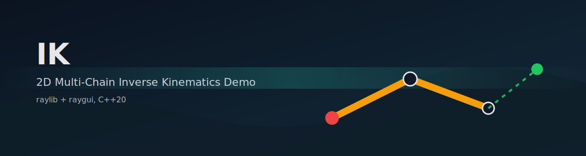
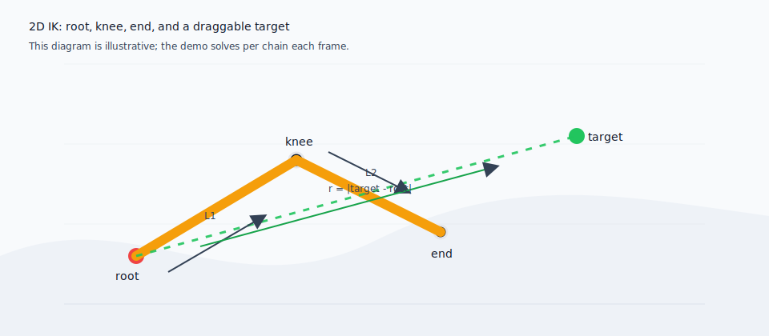
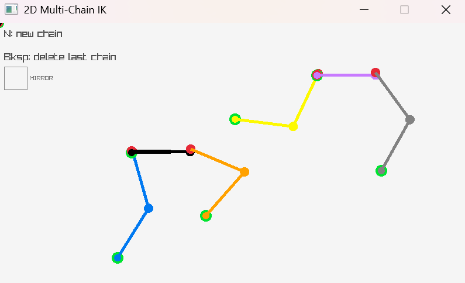
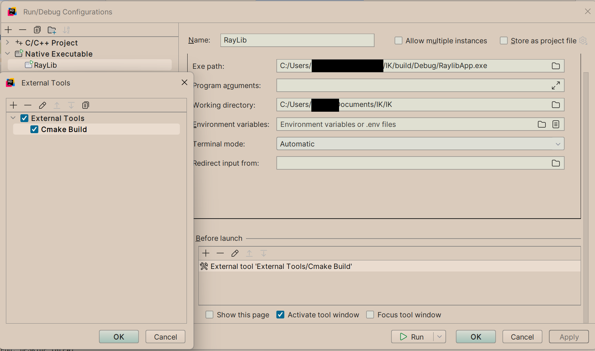

# IK (2D Multi-Chain IK Demo)



Interactive 2D inverse kinematics (IK) playground built with **raylib** + **raygui**.

## Preview



## Screenshot



## Controls

| Action | Control |
| --- | --- |
| Drag IK target | Left mouse (grab the green circle) |
| Add a new chain | `N` |
| Remove last chain | `Backspace` |
| Toggle mirrored knee bend | `MIRROR` checkbox |

## Build (Windows)

This repo currently assumes you have a raylib source checkout at `C:\raylib\raylib`:
- CMake links raylib via `IK/CMakeLists.txt`
- The app includes raylib headers via absolute includes in `IK/main.cpp`

### Visual Studio
1. Open `IK.sln`
2. Select `x64` + `Debug` (or `Release`)
3. Build and run the `IK` project

### CMake Presets (Visual Studio generator)
```powershell
cmake --preset x64-debug
cmake --build --preset x64-debug
```

The binary is built under `build/`.

## Rider Run Configuration (Important)

If you use **JetBrains Rider**, set the run config up as a **Native Executable** and run **CMake build** as an **External Tool** *before launch*. A Native Executable run config does not build by itself, so without the CMake step you can end up repeatedly running a stale `.exe` and not seeing your latest changes.

1. One-time: configure the build directory (from the repo root):
   - `cmake --preset x64-debug`
2. Create an External Tool (example name: `Cmake Build`):
   - Program: `cmake`
   - Arguments: `--build build --config Debug --target RaylibApp`
   - Working directory: `$ProjectFileDir$`
3. Create `Run/Debug Configuration` of type: `C/C++ Project` -> `Native Executable`
   - Name: `RayLib`
   - Exe path: `$ProjectFileDir$/build/Debug/RaylibApp.exe`
   - Working directory: `$ProjectFileDir$`
4. In the `RayLib` run config, add **Before launch**: `External Tools/Cmake Build`



## Notes

- To use a different raylib location, update the `add_subdirectory(...)` path in `IK/CMakeLists.txt`.
- For better portability, consider changing `IK/main.cpp` to include headers like `#include <raylib.h>` and configure include directories via CMake/VS instead of absolute `C:/...` includes.

## Reusable Solver (MVP)

The actual IK solver is a small, raylib-free, header-only utility you can copy into other projects (including Unreal):
- `IK/TwoBoneIK2D.h`

Minimal usage:
```cpp
#include "TwoBoneIK2D.h"

ik2d::Vec2 root{0.0f, 0.0f};
ik2d::Vec2 target{150.0f, 0.0f};

const auto res = ik2d::TwoBoneIK2D::Solve(root, /*L1*/ 100.0f, /*L2*/ 100.0f, target, /*bendDir*/ +1, /*autoBend*/ false);
// res.knee, res.end, res.theta1, res.theta2, ...
```

## IK Math (2-Bone)

This matches the implementation in `IK/TwoBoneIK2D.h` (`TwoBoneIK2D::Solve`) and uses **radians**.

Let:
- Root position: $\mathbf{p}_0$
- Target position: $\mathbf{p}_T$
- Segment lengths: $L_1$ (thigh), $L_2$ (shin)
- Local target vector: $\mathbf{t} = \mathbf{p}_T - \mathbf{p}_0$
- Distance: $r = \lVert \mathbf{t} \rVert$, clamped to the reachable range $[|L_1 - L_2|,\; L_1 + L_2]$
- Bend sign: $s \in \{+1,-1\}$ (chooses the mirrored "knee up/down" solution)

Angles:
$$
\phi = \operatorname{atan2}(t_y,\; t_x)
$$
$$
\psi = \arccos\!\left(\operatorname{clamp}\!\left(\frac{r^2 + L_1^2 - L_2^2}{2 L_1 r},\; -1,\; 1\right)\right)
$$
$$
\gamma = \arccos\!\left(\operatorname{clamp}\!\left(\frac{L_1^2 + L_2^2 - r^2}{2 L_1 L_2},\; -1,\; 1\right)\right)
$$

Relationships:
- $\phi$ is the direction from root to target.
- $\psi$ is the offset between $\phi$ and the first segment angle (from the law of cosines).
- $\gamma$ is the internal knee angle between the two segments (also from the law of cosines).

Joint angles:
$$
\theta_1 = \phi - s\,\psi
$$
$$
\theta_2 = s\,(\pi - \gamma)
$$

Where $\theta_1$ is the absolute angle of the first segment, and $(\theta_1 + \theta_2)$ is the absolute angle of the second segment.

Reconstruct positions:
$$
\mathbf{p}_{knee} = \mathbf{p}_0 + L_1\begin{bmatrix}\cos(\theta_1)\\ \sin(\theta_1)\end{bmatrix}
$$
$$
\mathbf{p}_{end} = \mathbf{p}_{knee} + L_2\begin{bmatrix}\cos(\theta_1 + \theta_2)\\ \sin(\theta_1 + \theta_2)\end{bmatrix}
$$
